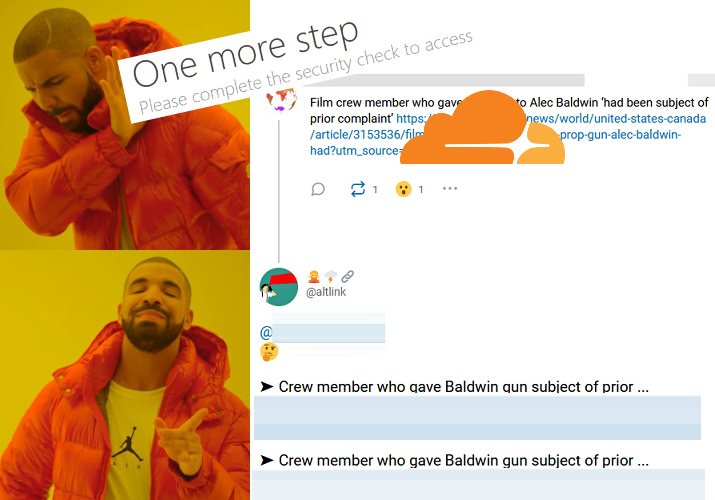

# Alternative Link (AltLink)


| 🖼 | 🖼 |
| -- | -- |
|  |  |


This is `opt-in` service.

[//]: # (please do not edit 'Currently MitiGator is'.)

Currently MitiGator is helping _4_ users from preventing sharing inaccessible links.


- Contents
  - [A little history](altlink.md#a-little-history)
  - [How to Subscribe](altlink.md#how-to-subscribe)
  - [How to Unsubscribe](altlink.md#how-to-unsubscribe)
  - [Suggest clean alternatives](altlink.md#suggest-clean-alternatives)
  - [Report a problem / Create an Issue](altlink.md#report-a-problem-create-an-issue)
  - [Settings](altlink.md#settings)
  - [Download PNG Logo](altlink.md#download-png-logo)


----

### A little history

Once upon a time there was a bot named "_[CloudflareLink](https://social.privacytools.io/@cloudflarelink/with_replies)_" which was created by Anonymous.
It replied to many users who shared CF links publicly.

Not many people reacted it positively. Here is some of them.

- kemonine@social.holdmybeer.solutions
```
To the owner of this bot
You should be ashamed.
Quit drive by bro'ing our statuses.
Please fornicate with a pointy stick.
```

- Sylvhem@eldritch.cafe
```
Pointing to a copy rather than the original document if it's still online is bad practice too. Also, you are a very annoying bot.
```

They got annoyed and Mastodon server owner was pressured by their "spam" reports.

One of Mastodon server owner once [said](../../tool/mastodonwch#some-public-reaction), "_your little protest bot is making people upset, and i'm worried it might cause people to defederate from the instance, please tone it down_."

For the record "_CloudflareLink_" was moved to other Mastodon servers 3 times and banned 2 times by 2 Mastodon services until the Anonymous decided to given up for good.

The main difference of AltLink is `opt-in`.
Those people who [share Cloudflare links casually](../cloudflared/shared_mastodon.md) never receive notification until they have a good heart and follow AL.


### How to Subscribe

1. **Follow** the [AltLink Account](https://101010.pl/@mg). (if you [do not have Mastodon account](https://101010.pl/invite/txvFuk9h))
  - Some instances such as [mastodon.social](https://github.com/mastodon/mastodon/issues/16480) are blocking Altlink.

2. Send _any text_ as **direct** ("Mentioned people only") message to above account.
  - e.g. `@mg follow`
  - And it will follow back you _instantly_ with introduction message.
    - If you're locking your account, please accept it's follow request otherwise it can't read your toots.
  - If you didn't got any reply make sure you are following it.

3. You're all set!
  - When you share Cloudflared link, it will send `direct` message to you with information.
  - If you want to tune your preference, visit Settings (explained below)


### How to Unsubscribe

1. Just `unfollow` it's account.
  - **it should unfollow you within an hour**.
    - it do not attempt to re-follow you.
  - If you've changed your mind and want to subscribe(opt-in) again simply `follow` again.


### Suggest clean alternatives

Just ask (send **direct** message to) it and he will provide some suggestions.

- This is related to Settings' `Suggest other non-Cloudflare alternative sites when available`.

Syntax: `@mg ?URL` or `？URL`

Put Cloudflared URL like this...

```
@mg ?https://cflove.myblog.site/cloud_is_internet/?blog=true
```

```
@mg

？https://invite.party/cloudflare_users_only/
```


**1** question per toot. Below does **not** work.

```
@mg
?https://matthew.prince/blog/
?https://matthewprince.site/
?https://matthew.prince.name/
```


### Report a problem / Create an Issue

- By default any direct message WILL NOT forwarded to issues for spam protection.
  - You can enable this option by going to `Settings website` and turn on `Talk` option.

You can create an Issue without git account. Just send a **direct** message.
And don't worry

- Multiple mentions (e.g. `@randomUser @mg @otherUser blah blah blah`)
- _Public_ message (e.g. `there's a bot called @mg`)

will be ignored to prevent spam.
Your username part (before `@`) will be masked to protect your privacy.


### Settings

You can configure it from [this website](https://mitigator.crimeflare.eu.org).


- **Easier way**: From your Mastodon, send a Direct Message with keyword below.
  - _one of_: `help` `set` `settings` `conf` `config` `cfg`
  - e.g. `@mg set`


### Download PNG Logo

For your poster/meme needs.

- Try [Meme Generator](https://mitigator.crimeflare.eu.org/meme/)

MitiGator's profile image shows an orange shield and a cartoon of the mascot character, 𝙈𝙞𝙩𝙞𝙂𝙖𝙩𝙤𝙧, who stands proud as the MITM Prevention Alligator.
The mascot wears a referee top and red sash across chest. Above the shield is 'MitiGator' in arching, bold, small caps, serif lettering.


| 🖼 | 🖼 | 🖼 | 🖼 |
| -- | -- | -- | -- |
|  |  | - | - |
|  |  |  |  |


---

- Mastodon servers are controlled by third party.
  - Let us know if above account is censored by aggressive Cloudflare supporters.
- ↳ ["Cloudflare, we have a problem" Mastodon](../people/mastodon.md)
- ↳ [How many % of public Fediverse services are using Cloudflare?](../cloudflared/fediverse.md)
- ↳ [How many % of links people publicly shared on Mastodon are using Cloudflare?](../cloudflared/shared_mastodon.md)

