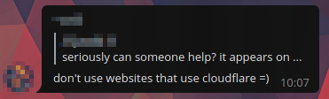

# Crimeflare Public DNS

### About this service

- **No** logs. **No** statistics! **No** collection!! Say NO to data collection ;)
  - Plain simple DNS: DNS for any devices.
  - Unlike those popular public DNS service:
    - Google Public DNS (8.8.8.8), the default value of Android, Routers and some Linux, [collects information](https://web.archive.org/web/20230618153339/https://developers.google.com/speed/public-dns/privacy) such as queries including requested domain name and IP address.
    - Cloudflare (1.1.1.1) also [collects information](https://web.archive.org/web/20230626025054/https://developers.cloudflare.com/1.1.1.1/privacy/public-dns-resolver/) such as queryName and IP. They also categorize them and list data publicly.
- **Block Cloudflare** sites. There are better ethical websites on the internet!
  - Return answer will be empty.
- **Block problematic/unsafe contents** using StevenBlack's [adware + malware](https://github.com/StevenBlack/hosts/blob/master/readme.md) list.
  - Note: We DO NOT censor/filter other things. Please report false positive to above list provider.
- **Block DNS-rebind attack**.

And hey, if you are network administrator do [block Cloudflare](../block_cloudflare_with/dns.md) for your users!

### Details

| Type | Value | Note |
| --- | --- | --- |
| DNS (UDP) | `65.21.252.201` `53/udp` | - |
| DNS (TCP) | `65.21.252.201` `53/tcp` | TCP is rate-limited softly. |
| DNSCrypt | `65.21.252.201:5353` Public key: `4c2180637316a2e36654cb9ce53915147cf824fed6b3cfcb83a39b7a036172c3` Provider name: `2.dnscrypt-cert.crimeflare.decloudflare.dns` DNS Stamp: `sdns://AQMAAAAAAAAAEjY1LjIxLjI1Mi4yMDE6NTM1MyBMIYBjcxai42ZUy5zlORUUfPgk_tazz8uDo5t6A2FywysyLmRuc2NyeXB0LWNlcnQuY3JpbWVmbGFyZS5kZWNsb3VkZmxhcmUuZG5z` |
| DNS-over-HTTPS | `https://dns.crimeflare.eu.org:5443/dns-query` |  |
