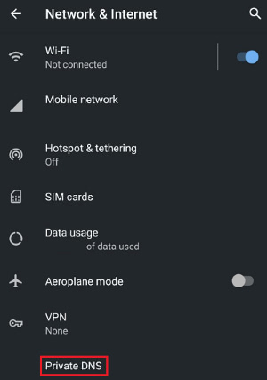

# Crimeflare Public DNS

### About this service

- **No** logs. **No** statistics! **No** collection!! Plain simple DNS ;)
  - DNS for any devices.
- **Block Cloudflare** sites. There are better ethical websites on the internet!
  - Return answer will be empty.
- **Block problematic/unsafe contents**, lists provided by
  - 1. [My Privacy DNS](https://mypdns.eu.org)
    - Malicious / Malware
    - Spyware
    - Phishing
    - Scamming
    - TypoSquatting
  - 2. [adware + malware](https://github.com/StevenBlack/hosts/blob/master/readme.md)
- **Block DNS-rebind attack**.

And hey, if you are network administrator do [block Cloudflare](../block_cloudflare_with/dns.md) for your users!

### Details

| Type | Value | Note |
| --- | --- | --- |
| DNS (UDP) | `65.21.252.201` `53/udp` | - |
| DNS (TCP) | `65.21.252.201` `53/tcp` | TCP is rate-limited softly. |
| DNSCrypt | `65.21.252.201:5353` Public key: `46d7936d5e6bf4fc78de5389452d46b97fad57aea032b4884356d912fb34fb12` Provider name: `2.dnscrypt-cert.crimeflare.decloudflare.dns` DNS Stamp: `sdns://AQMAAAAAAAAAEjY1LjIxLjI1Mi4yMDE6NTM1MyBMIYBjcxai42ZUy5zlORUUfPgk_tazz8uDo5t6A2FywysyLmRuc2NyeXB0LWNlcnQuY3JpbWVmbGFyZS5kZWNsb3VkZmxhcmUuZG5z` |
| DNS-over-TLS | `karma.crimeflare.eu.org` `853/tcp` |  |
